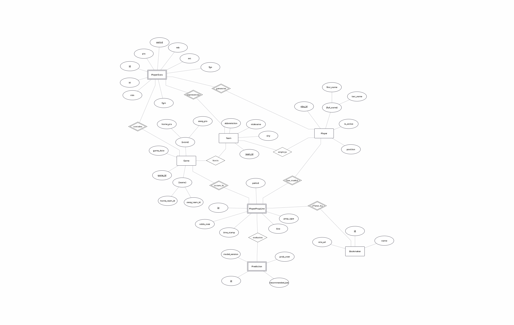

# Schema Reference

This document reflects the current Django models in
`backend/nba_betting/models.py`.

## Team
Primary key:
- id (BigAutoField)

Foreign keys:
- None

| Field | Type | Required | Notes |
| --- | --- | --- | --- |
| city | string | Yes | Team city. |
| nickname | string | Yes | Team nickname. |
| abbreviation | string | Yes | Team abbreviation. |

## Bookmaker
Primary key:
- id (BigAutoField)

Foreign keys:
- None

| Field | Type | Required | Notes |
| --- | --- | --- | --- |
| name | string | Yes | Bookmaker name. |
| site_url | string | No | Optional site URL. |

## Player
Primary key:
- nba_id (PositiveIntegerField)

Foreign keys:
- current_team -> Team.id (nullable)

Constraints/indexes:
- PK on nba_id

| Field | Type | Required | Notes |
| --- | --- | --- | --- |
| first_name | string | Yes | First name. |
| last_name | string | Yes | Last name. |
| position | string | Yes | Roster position. |
| is_active | bool | Yes | Active roster flag. |
| current_team | FK -> Team | No | Nullable team reference. |

## Game
Primary key:
- game_id (CharField)

Foreign keys:
- home_team -> Team.id
- away_team -> Team.id

Constraints/indexes:
- PK on game_id

| Field | Type | Required | Notes |
| --- | --- | --- | --- |
| game_id | string | Yes | NBA API game ID. |
| date | date | Yes | Game date. |
| season | string | Yes | Season label (ex: 2023-24). |
| home_score | int | Yes | Final score. |
| away_score | int | Yes | Final score. |

## PlayerStats
Primary key:
- id (BigAutoField)

Foreign keys:
- player -> Player.nba_id
- game -> Game.game_id
- team -> Team.id

Constraints/indexes:
- Unique: (player, game, period)
- FK indexes on player, game, team (implicit)

| Field | Type | Required | Notes |
| --- | --- | --- | --- |
| player | FK -> Player | Yes | Player reference. |
| game | FK -> Game | Yes | Game reference. |
| team | FK -> Team | Yes | Team for this game. |
| period | int | Yes | 0=Full, 1-4=Quarter. |
| pts | int | Yes | Points. |
| reb | int | Yes | Rebounds. |
| ast | int | Yes | Assists. |
| min | float | Yes | Minutes played. |
| fga | int | Yes | Field goal attempts. |
| fgm | int | Yes | Field goals made. |

## PlayerPropLine
Primary key:
- id (BigAutoField)

Foreign keys:
- player -> Player.nba_id
- game -> Game.game_id
- bookmaker -> Bookmaker.id

Constraints/indexes:
- Unique: (player, game, bookmaker, prop_type, period)
- FK indexes on player, game, bookmaker (implicit)

| Field | Type | Required | Notes |
| --- | --- | --- | --- |
| player | FK -> Player | Yes | Player reference. |
| game | FK -> Game | Yes | Game reference. |
| bookmaker | FK -> Bookmaker | Yes | Bookmaker reference. |
| prop_type | string | Yes | Points, rebounds, etc. |
| period | int | Yes | 0=Full, 1-4=Quarter. |
| line | float | Yes | Betting line value. |
| odds_over | int | Yes | Over odds. |
| odds_under | int | Yes | Under odds. |
| timestamp | datetime | Yes | Line timestamp. |

## Prediction
Primary key:
- id (BigAutoField)

Foreign keys:
- prop_line -> PlayerPropLine.id

Constraints/indexes:
- FK index on prop_line (implicit)

| Field | Type | Required | Notes |
| --- | --- | --- | --- |
| prop_line | FK -> PlayerPropLine | Yes | Parent line. |
| model_version | string | Yes | Model version tag. |
| prediction_timestamp | datetime | Yes | Scoring time. |
| prob_over | float | Yes | Probability of hitting over. |
| recommendation | string | Yes | Text recommendation. |

---

# Schema Specification (Source of Truth)

This section defines the target schema at a high level. Use it as a reference
when aligning models to the EERD.

## Core Reference Models

### Team
- Primary key: `id`
- Fields: `city`, `nickname`, `abbreviation`

### Bookmaker
- Primary key: `id`
- Fields: `name` (ex: DraftKings)

### Player
- Primary key: `nba_id` (from NBA API)
- Fields: `first_name`, `last_name`, `position`, `is_active`
- Foreign keys: `current_team` (nullable)

### Game
- Primary key: `game_id` (NBA API ID)
- Fields: `date`, `season`, `home_score`, `away_score`
- Foreign keys: `home_team`, `away_team`

## Data Models (Weak Entities)

### PlayerStats (Collapsed Supertype)
- Foreign keys: `player`, `game`, `team` (team at time of game)
- Fields: `period` (0=Full, 1-4=Quarter), `pts`, `reb`, `ast`, `min`, `fga`, `fgm`
- Constraints: `unique_together = ['player', 'game', 'period']`

### PlayerPropLine (Market)
- Foreign keys: `player`, `game`, `bookmaker`
- Fields: `prop_type`, `period`, `line`, `odds_over`, `odds_under`, `timestamp`
- Constraints: `unique_together = ['player', 'game', 'bookmaker', 'prop_type', 'period']`
  (include timestamp if tracking history)

### Prediction (ML Output)
- Foreign keys: `prop_line`
- Fields: `model_version`, `prediction_timestamp`, `prob_over`, `recommendation`

---

# Agent-Ready Prompt: Schema Integrity Audit

**Role:** Senior Django Architect & Database Designer  
**Project:** NBA Period Predictor (Backend)  
**Current Task:** Verify `backend/nba_betting/models.py` against the "Target Schema Specification".

## Context

We have finalized the Enhanced Entity Relationship Diagram (EERD) for the
application. We need to ensure the actual Django code (`models.py`) matches this
design exactly before we run migrations.

## The Target Schema Specification

### 1. Strong Entities

**Team**: Needs `team_id` (PK), `city`, `nickname`, `abbreviation`.  
**Bookmaker**: Needs `name`, `site_url`.  
**Player**: Needs `nba_id` (PK), `first_name`, `last_name` (Composite split),
`position`, `is_active`.  
Relationship: `current_team` (FK to Team, nullable).  

**Game**: Needs `game_id` (PK), `date`, `season`, `home_score`, `away_score`.  
Relationship: `home_team` (FK to Team), `away_team` (FK to Team).  

### 2. Weak Entities & Logic

**PlayerStats**:
Logic: Collapsed Supertype. Uses `period` field (0=Full Game, 1-4=Quarter).  
Relationships: Must link to `Player`, `Game`, AND `Team`
(to track historical team at time of game).  
Constraint: `unique_together = ['player', 'game', 'period']`.  

**PlayerPropLine**:
Logic: Represents a betting line offered by a specific bookmaker.  
Relationships: Must link to `Player`, `Game`, and `Bookmaker`.  
Constraint: `unique_together` on player, game, bookmaker, prop_type, and period.  

**Prediction**:
Logic: A child of the Prop Line.  
Relationship: FK to `PlayerPropLine` (NOT Player).  

## Instructions

1. Read: Analyze the current contents of `backend/nba_betting/models.py`.
2. Compare: Check for the following specific gaps:
- Does the `Bookmaker` model exist?
- Does `Player` have `first_name`/`last_name` split?
- Does `PlayerStats` have the `team` Foreign Key (to track historical context)?
- Is `Prediction` correctly linked to `PlayerPropLine` (instead of Player)?
- Are `unique_together` constraints present on Stats and PropLines?

3. Report:
- List every discrepancy found.
- Ask me: "Shall I refactor `models.py` to match the Target Schema?"
